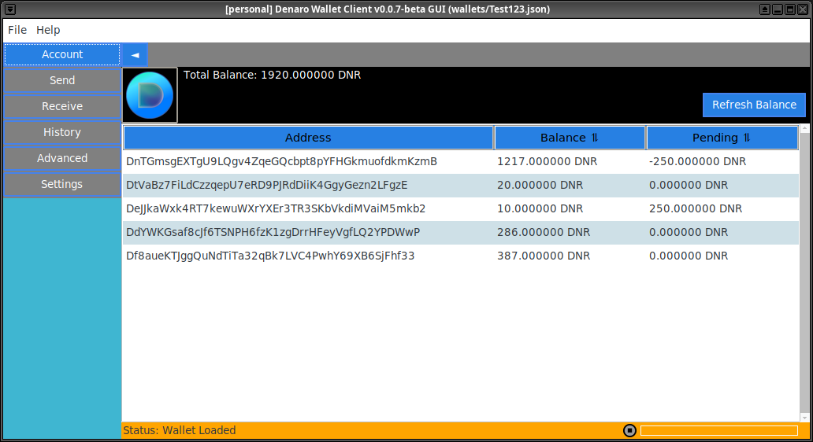

# Denaro Wallet Client GUI

**This repo contains the source code for the Denaro Wallet Client, developed for the Denaro cryptocurrency. It has been designed with a strong emphasis on security, providing users with a secure and efficient way to manage their digital assets.** 

The wallet client provides essential functionalities such as wallet creation, address generation, transaction processing, balance checking, and wallet imports. Advanced functionalities are also provided, including encryption and decryption of wallet data, optional two-factor authentication (2FA), wallet entry filtering, support for deterministic wallets, and several security measures to protect wallet data *(See the [Wallet Security Framework](#wallet-security-framework) section for more details)*.




## Important Note from Developer

**Denaro's active development has been moved to this Github repository: https://github.com/The-Sycorax/denaro**

**Some users and I have been coordinating a revival effort for Denaro, and substantial updates have been made to it's codebase in the above repository. However, Denaro's original upstream repository has yet to be updated, but a pull request is planned for the future.**

**If you want to operate a Denaro node, please use the code and instructions from the repository linked above.**

### Links:
* **New Website: [https://denaro.mine.bz](https://denaro.mine.bz/)**
* **Denaro Node: [https://node.denaro.network](https://node.denaro.network/)**
* **Block Explorer: [https://denaro-explorer.aldgram-solutions.fr](https://denaro-explorer.aldgram-solutions.fr/)**
* **Discord Server: [https://discord.gg/4Sq2dK4KMv](https://discord.gg/4Sq2dK4KMv)**


## Installation Guide
*Note: The Denaro Wallet Client has not been tested on Windows or MacOS and support is unknown at this time. It is reccomended to use the wallet client on Ubuntu/Debian Linux to avoid any compatibility or stability issues.*

```bash
# Clone the repository
git clone https://github.com/The-Sycorax/DenaroWalletClient-GUI.git
cd DenaroWalletClient-GUI

# Update package list and install required library
sudo apt update
sudo apt install libgmp-dev

# Create a Python virtual environment (Optional).
sudo apt install python3-venv
python3 -m venv venv
source venv/bin/activate

# Install the required packages
pip3 install -r requirements.txt

# Run the wallet client GUI
python3 gui.py

# Optionally run the wallet client CLI
python3 wallet_client.py <options>
```

To exit the Python Virtual Environment use:
```bash
deactivate
```

------------

## Usage Documentation

**The Denaro Wallet Client** provides a rebust CLI for various operations. This section provides detailed usage documentation for the various sub-commands along with their corresponding options.

**Important: *When working with encrypted wallets, the password used to decrypt it must always be supplied via the `-password` option. Additionally, to ensure a high level of security, the wallet client has been designed with an auto-delete feature for encrypted wallets. After 10 unsuccessful password attempts, the wallet will be automatically deleted in order to protect its contents and safeguard against unauthorized access. See [Wallet Annihilation](#wallet-annihilation) for more deatils.***

<details>
<summary><b>Sub-Commands:</b></summary>
<dl><dd>

  <details>
  <summary><b><code>generate wallet</code>:</b></summary>
  <dl><dd>

  This sub-command is used to generate wallets or overwrite existing ones. When a new wallet is created it will contain a single Denaro address. Addresses are generated based on wheather the wallet is `deterministic` or `non-deterministic`.
    
  Wallets can also be encrypted and have Two-Factor Authentication (2FA) enabled for better security. When encryption is enabled, wallet files remain structured as JSON but the sensitive data they contain remain encrypted for the entirety of its lifecycle. See [In-Memory Processing and Zero-Disk Plaintext Policy](https://github.com/The-Sycorax/DenaroWalletClient-GUI?tab=readme-ov-file#in-memory-processing-and-zero-disk-plaintext-policy) for more details.

  **Syntax**:
  
  <dl><dd>

  ```bash
  wallet_client.py generate wallet [-h] [-verbose] -wallet WALLET [-encrypt] [-2fa] [-deterministic] [-phrase PHRASE] [-password PASSWORD] [-backup {False,True}] [-disable-overwrite-warning] [-overwrite-password OVERWRITE_PASSWORD]
  ```
  
  </dd><dl>

  <details>
  <summary><b>Options:</b></summary>
  <dl><dd>

  * `-wallet` (Required): The filename or filepath of a wallet. Defaults to the `./wallets/` directory if no specific filepath is provided.
  
  * `-encrypt`: Enables wallet encryption.
  
  * `-2fa`: Enables 2-Factor Authentication for encrypted wallets.
  
  * `-deterministic`: Enables deterministic address generation.
  
  * `-phrase`: Generates a wallet based on a 12 word mnemonic phrase. The mnemonic phrase must also be enclosed in quotation marks. This option can be used to restore deterministic wallets.
  
  * `-password`: The password for encrypting the wallet.
  
  * `-backup`: When attempting to overwrite an existing wallet, the user is typically shown a prompt asking if they want to backup the wallet. This option skips this prompt, and requires either a `True` or `False` parameter which specifies whether the wallet should be backed up.
  
  * `-disable-overwrite-warning`: If an existing wallet is not backed up, an overwrite warning is typically shown in the console, along with a prompt asking the user if they want to proceed. This option skips this prompt entirely.
  
  * `-overwrite-password`: When attempting to overwrite an encrypted wallet, the password for it is required as a final confirmation of the overwrite. The user is typically prompted to type this in the console. This option skips this entirely, and requires the password of the encrypted wallet as a parameter. If the password is correct, the overwrite will proceed.
  
  * `-verbose`: Enables verbose logging of info and debug messages.

  </dd></dl>
  </details>

  <details>
  <summary><b>Wallet JSON Format:</b></summary>
  <dl><dd>

  Wallet data is structured in JSON format when it is either decrypted or left un-encrypted. The primary difference between wallet types lies in the `entry_data` object array, specifically regarding the type of address generation used by the wallet (`deterministic` or `non-deterministic`).

  <details>
  <summary><b>Non-Deterministic Wallet Format:</b></summary>
  <dl><dd>

  In a non-deterministic wallet, each generated entry has its own unique mnemonic phrase.

  ```json
  {
    "wallet_data": {
      "wallet_type": "non-deterministic",
      "version": "<version-string>",
      "entry_data": {
        "entries": [
          {
            "id": "<int-string>",
            "mnemonic": "<string>",
            "private_key": "<string>",
            "public_key": "<string>",
            "address": "<string>"
          }
        ],
        "imported_entries": [
          {
            "id": "<int-string>",
            "private_key": "<string>",
            "public_key": "<string>",
            "address": "<string>"
          }
        ]
      }
    }
  }
  ```

  </dd></dl>
  </details>

  <details>
  <summary><b>Deterministic Wallet Format:</b></summary>
  <dl><dd>

  In a deterministic wallet, all generated entries are derived from a single `master_mnemonic`. Individual entries do not have their own mnemonic phrases.

  ```json
  {
    "wallet_data": {
      "wallet_type": "deterministic",
      "version": "<version-string>",
      "entry_data": {
        "master_mnemonic": "<string>",
        "entries": [
          {
            "id": "<int-string>",
            "private_key": "<string>",
            "public_key": "<string>",
            "address": "<string>"
          }
        ],
        "imported_entries": [
          {
            "id": "<int-string>",
            "private_key": "<string>",
            "public_key": "<string>",
            "address": "<string>"
          }
        ]
      }
    }
  }
  ```

  </dd></dl>
  </details>

  </dd></dl>
  </details>

  </dd></dl>
  </details>

  <details>
  <summary><b><code>generate address</code>:</b></summary>
  <dl><dd>

  This sub-command is used to generate new addresses and add them to a wallet. For encrypted wallets, only the cryptographic keys of addresses are added. These are later used during decryption to derive the data associated with them (e.g. private_key, public_key, and address).

  **Syntax**:

  <dl><dd>

  ```bash
  wallet_client.py generate address [-h] [-verbose] -wallet WALLET [-password PASSWORD] [-2fa-code TFACODE] [-amount AMOUNT]
  ```
  
  </dd></dl>

  <details>
  <summary><b>Options:</b></summary>
  <dl><dd>

  * `-wallet` (Required): The filename or filepath of a wallet. Defaults to the `./wallets/` directory if no specific filepath is provided.
  
  * `-password`: The password of the specified wallet. Required if the wallet is encrypted.
  
  * `-2fa-code`: Optional Two-Factor Authentication code for encrypted wallets that have 2FA enabled. Should be the 6-digit code generated from an authenticator app.
  
  * `-amount`: Specifies the amount of addresses to generate (Maximum of 256).
  
  * `-verbose`: Enables verbose logging of info and debug messages.

  </dd></dl>
  </details>

  </dd></dl>
  </details>

  <details>
  <summary><b><code>generate paperwallet</code>:</b></summary>
  <dl><dd>

  This sub-command is used to generate a Denaro paper wallet either by using an address that is associated with a wallet file, or directly via the private key of a Denaro address.

  * *If specifying an address stored in a wallet file, the generated paper wallet will be stored in `./wallets/paper_wallet/[walletName]/`.*
  
  * *If specifying the private key of an address, the generated paper wallet will be stored in `./wallets/paper_wallets/`.*
  
  * *All generated paper wallets inherit the name of it's associated address.*

  **Syntax**:

  <dl><dd>

  ```bash
  wallet_client.py generate paperwallet [-h] [-verbose] [-wallet WALLET] [-password PASSWORD] [-2fa-code TFACODE] [-address ADDRESS] [-private-key PRIVATE_KEY] [-type {pdf,png}]
  ```

  </dd></dl>

  <details>
  <summary><b>Options:</b></summary>
  <dl><dd>

  * `-wallet`: The filename or filepath of a wallet. Defaults to the `./wallets/` directory if no specific filepath is provided.
  
  * `-password`: The password of the specified wallet. Required if the wallet is encrypted.
  
  * `-2fa-code`: Optional Two-Factor Authentication code for encrypted wallets that have 2FA enabled. Should be the 6-digit code generated from an authenticator app.
  
  * `-address`: A Denaro address that is stored in the wallet. A paper wallet will be generated for this Denaro address.
  
  * `-private-key`: The private key of a Denaro address. This is not required if specifying an address from a wallet.
  
  * `-type`: Specifies the file type for the paper wallet. The default filetype is PDF.
    * `-type png` generates a PNG image of the front of the paper wallet.
    
    * `-type pdf` generates a PDF file of the front and back of the paper wallet.

  </dd></dl>
  </details>

  <details>
  <summary><b>Paper Wallet Design:</b></summary>
  <dl><dd>
  <dl><dd>
  <dl><dd>

  
  

  </dd></dl>
  </dd></dl>
  </dd></dl>
  </details>


  </dd></dl>
  </details>

  <details>
  <summary><b><code>decryptwallet</code>:</b></summary>
  <dl><dd>

  This sub-command can either decrypt all entries in a wallet file, or selectivly decrypt specific entries based on a provided filter, and return the decrypted data back to the console.

  This sub-command was initially designed to only return data for encrypted wallets, but has since been re-factored to also return data for un-encrypted wallets.

  **Syntax**:

  <dl><dd>

  ```bash
  wallet_client.py decryptwallet [-h] [-verbose] -wallet WALLET [-password PASSWORD] [-2fa-code TFACODE] [-json] {filter} ...
  ```

  </dd></dl>

  <details>
  <summary><b>Options:</b></summary>
  <dl><dd>

  * `-wallet` (Required): The filename or filepath of a wallet. Defaults to the `./wallets/` directory if no specific filepath is provided.
  
  * `-password`: The password of the specified wallet. Required if the wallet is encrypted.
  
  * `-2fa-code`: Optional Two-Factor Authentication code for encrypted wallets that have 2FA enabled. Should be the 6-digit code generated from an authenticator app.
  
  * `-json`: Print formatted JSON output for better readability.

  </dd></dl>
  </details>

  </dd></dl>
  </details>

  <details>
  <summary id="sub-command-decryptwallet-filter"><b><code>decryptwallet filter</code>:</b></summary>
  <dl><dd>

  This sub-command filters wallet entries by one or more addresses and/or fields. Adding a hyphen `-` to the beginning of an address will exclude it from the results. Wallet entries can also be filtered based on origin (See `-show` option for more details). This sub-command should come directly after the other options that have been provided for `decryptwallet`.

  **Syntax**:

  <dl><dd>

  ```bash
  wallet_client.py decryptwallet <options> filter [-h] [-verbose] [-address ADDRESS] [-field FIELD] [-show {generated,imported}]
  ```

  </dd></dl>

  <details>
  <summary><b>Options:</b></summary>
  <dl><dd>

  * `-address`: Filters one or more addresses that are stored in the wallet. Adding a hyphen `-` to the beginning of an address will exclude it from the output.
    * The format is:

    <dl><dd>
    <dl><dd>
    <dl><dd>

    ```bash
    fliter -address=ADDRESS_1,-ADDRESS_2,...
    ```

    </dd></dl>
    </dd></dl>
    </dd></dl>
  
  * `-field`: One or more fields to filter by.
    * The format is:

    <dl><dd>
    <dl><dd>
    <dl><dd>

    ```bash
    -field=id,mnemonic,private_key,public_key,address
    ```
    
    </dd></dl>
    </dd></dl>
    </dd></dl>
  
  * `-show`: Filters wallet entries origin.
    * `-show generated`: Retrieves only the information of internally generated wallet entries.
    
    * `-show imported`: Retrieves only the information of imported wallet entries.

  </dd></dl>
  </details>

  </dd></dl>
  </details>

  <details>
  <summary><b><code>send</code>:</b></summary>
  <dl><dd>

  This sub-command is used to create a transaction on the Denaro blockchain. It allows users to send Denaro to a specified address.

  *Note: The source of funds for the transaction (the sender) can be specified in two ways: either by using an address that is associated with a wallet file, or directly via the private key of a Denaro address.*

  **Syntax**:

  <dl><dd>

  ```bash
  wallet_client.py send [-h] [-verbose] [-node NODE] -amount <AMOUNT> from [-wallet WALLET] [-password PASSWORD] [-2fa-code TFACODE] [-address ADDRESS] [-private-key PRIVATE_KEY] to <receiver> [-message MESSAGE]
  ```

  </dd></dl>

  <details>
  <summary><b>Options:</b></summary>
  <dl><dd>

  * `send`: Main command to initiate a transaction.
    * `-amount` (Required): Specifies the amount of Denaro to be sent.
  
  * `from <options>`: Specifies the sender's details.
    * `-wallet`: The filename or filepath of a wallet. Defaults to the `./wallets/` directory if no specific filepath is provided.
  
    * `-password`: The password of the specified wallet. Required if the wallet is encrypted.
  
    * `-2fa-code`: Optional Two-Factor Authentication code for encrypted wallets that have 2FA enabled. Should be the 6-digit code generated from an authenticator app.
  
    * `-address`: A Denaro address that is stored in the wallet. This address is used to create the transaction and send funds.
  
    * `-private-key`: The private key of a Denaro address. Not required if specifying an address that is stored in a wallet file.
  
  * `to <options>`: Specifies the receiver's details.
    * `receiver` (Required): The receiving address.
  
    * `-message`: Optional transaction message.
  
  * `-node`: Specifies the Denaro node to connect to. Must be a valid IP Address or URL. If not specified or the node is not valid, then the wallet client will use the default Denaro node (http://localhost:3006).

  </dd></dl>
  </details>

  </dd></dl>
  </details>

  <details>
  <summary id="sub-command-balance"><b><code>balance</code>:</b></summary>
  <dl><dd>

  This sub-command is used to check the balance of addresses on the Denaro blockchain that are asociated with a specified wallet file.

  *Similar to `decryptwallet filter`, the `balance` sub-command can also filter wallet entries. The `-address` option can be used to filter one or more addresses that are stored in a wallet. Addresses can be excluded by adding a hyphen (`-`) to the beginning of it. Wallet entries can also be filtered based on origin (See `-show` option for more details).*

  **Syntax**:

  <dl><dd>

  ```bash
  wallet_client.py balance [-h] [-verbose] [-node NODE] -wallet WALLET [-password PASSWORD] [-2fa-code TFACODE] [-address ADDRESS] [-convert-to CURRENCY_CODE] [-show {generated,imported}] [-json] [-to-file]
  ```

  </dd></dl>

  <details>
  <summary><b>Options:</b></summary>
  <dl><dd>

  * `-wallet` (Required): The filename or filepath of a wallet. Defaults to the `./wallets/` directory if no specific filepath is provided.
  
  * `-password`: The password of the specified wallet. Required if the wallet is encrypted.
  
  * `-2fa-code`: Optional Two-Factor Authentication code for encrypted wallets that have 2FA enabled. Should be the 6-digit code generated from an authenticator app.
  
  * `-address`:  One or more Denaro addresses that are stored in the wallet to get the balance of. Adding a hyphen `-` to the beginning of an address will exclude it. If not specified, then the balances of all addresses stored in the wallet will be shown.
    * The format is:

    <dl><dd>
    <dl><dd>
    <dl><dd>

    ```bash
    -address=ADDRESS_1,-ADDRESS_2,...
    ```

    </dd></dl>
    </dd></dl>
    </dd></dl>
  
  * `-convert-to`: Converts the monetary value of balances to a user specified currency, factoring in current exchange rates against the USD value of DNR. Supports 161 international currencies and major cryptocurrencies. A valid currency code is required (e.g., 'USD', 'EUR', 'GBP', 'BTC'). By default balance values are calculated in USD.
  
  * `-show`: Filters balance information based on wallet entry origin.
    * `-show generated`: Retrieves only the balance information of internally generated wallet entries.
    
    * `-show imported`: Retrieves only the balance information of imported wallet entries.
  
  * `-json`: Prints the balance information in JSON format.
  
  * `-to-file`: Saves the output of the balance information to a file. The resulting file will be in JSON format and named as "*[WalletName]​_balance_[Timestamp].json*" and will be stored in "*/[WalletDirectory]/balance_information/[WalletName]/*".
  
  * `-node`: Specifies the Denaro node to connect to. Must be a valid IP Address or URL. If not specified or the node is not valid, then the wallet client will use the default Denaro node (http://localhost:3006).

  </dd></dl>
  </details>

  <details>
  <summary><b>Balance JSON Format:</b></summary>
  <dl><dd>
  <dl><dd>

  When saved to a file or when the `-json` option is used, the balance information will be structured in JSON format. It includes details for both generated and imported addresses, along with total balances and the current exchange rate.

```json
  {
  "balance_data": {
    "wallet_file_path": "<path-string>",
    "wallet_version": "<version-string>",
    "addresses": [
      {
        "id": "<int-string>",
        "address": "<string>",
        "balance": {
          "currency": "DNR",
          "amount": "<decimal-string>",
          "<currency_code>_value": "<currency_symbol><decimal-string>"
        }
      }
    ],
    "imported_addresses": [
      {
        "id": "<int-string>",
        "address": "<string>",
        "balance": {
          "currency": "DNR",
          "amount": "<decimal-string>",
          "<currency_code>_value": "<currency_symbol><decimal-string>"
        }
      }
    ],
    "exchange_rate": "<currency_symbol><decimal-string>",
    "total_balance": "<decimal-string> DNR",
    "total_<currency_code>_value": "<currency_symbol><decimal-string>",
    "lastUpdated": "<datetime-string>"
  }
}
```
  
  </dd></dl>
  </dd></dl>
  </details>

  </dd></dl>
  </details>

  <details>
  <summary><b><code>import</code>:</b></summary>
  <dl><dd>

  This sub-command is used to import a Denaro address into a specified wallet file via it's private key.

  **Syntax**:

  <dl><dd>

  ```bash
  wallet_client.py import [-h] [-verbose] -wallet WALLET [-password PASSWORD] [-2fa-code TFACODE] -private-key PRIVATE_KEY
  ```

  </dd></dl>

  <details>
  <summary><b>Options:</b></summary>
  <dl><dd>

  * `-wallet` (Required): The filename or filepath of the wallet. Defaults to the `./wallets/` directory if no specific filepath is provided. This specifies wallet where the address will be imported.
  
  * `-password`: The password of the specified wallet. Required if the wallet is encrypted.
  
  * `-2fa-code`: Optional Two-Factor Authentication code for encrypted wallets that have 2FA enabled. Should be the 6-digit code generated from an authenticator app.
  
  * `-private-key`: The private key of a Denaro address. This is used to generate the corresponding address data that will be imported into the  wallet file.

  </dd></dl>
  </details>

  </dd></dl>
  </details>

  <details>
  <summary><b><code>backupwallet</code>:</b></summary>
  <dl><dd>

  This sub-command is used to backup a wallet file. An option to choose the backup directory is available.

  **Syntax**:

  <dl><dd>

  ```bash
  wallet_client.py backupwallet [-h] -wallet WALLET [-path PATH]
  ```

  </dd></dl>

  <details>
  <summary><b>Options:</b></summary>
  <dl><dd>

  * `-wallet` (Required): The filename or filepath of a wallet. Defaults to the `./wallets/` directory if no specific filepath is provided. This specifies be the wallet to backup.
  
  * `-path`: The directory to save the backup file. Defaults to the `./wallets/wallet_backups/` directory if no specific filepath is provided.

  </dd></dl>
  </details>

  </dd></dl>
  </details>

</dd></dl>
</details>
       

<details>
<summary><b>Usage Examples:</b></summary>
<dl><dd>

<details>
<summary><b>Generating Wallets:</b></summary>
<dl><dd>

<i>The wallet filename does not require a .json extension to be added as this is entirely optional. By default, the script will add the extension to the filename if not present.</i>

  <details>
  <summary>Generates an un-encrypted non-deterministic wallet:</summary>
  <dl><dd>

  ```bash
  python3 wallet_client.py generate wallet -wallet=wallet.json
  ```

  </dd></dl>
  </details>

  <details>
  <summary>Generates an un-encrypted deterministic wallet:</summary>
  <dl><dd>

  ```bash
  python3 wallet_client.py generate wallet -deterministic -wallet=wallet.json
  ```

  </dd></dl>
  </details>
        
  <details>
  <summary>Generates an encrypted non-deterministic wallet:</summary>
  <dl><dd>

  ```bash
  python3 wallet_client.py generate wallet -encrypt -wallet=wallet.json -password=MySecurePassword
  ```

  </dd></dl>
  </details>

  <details>
  <summary>Generates an encrypted deterministic wallet, with 2-Factor Authentication:</summary>
  <dl><dd>

  ```bash
  python3 wallet_client.py generate wallet -encrypt -deterministic -2fa -wallet=wallet.json -password=MySecurePassword
  ```

  </dd></dl>
  </details>
    
  <details>
  <summary>Creates a backup of an encrypted wallet, and overwrites it with a new wallet, while skipping prompts:</summary>
  <dl><dd>

  ```bash
  python3 wallet_client.py generate wallet -wallet=wallet.json -deterministic -backup=True -disable-overwrite-warning -overwrite-password=MySecurePassword
  ```

  </dd></dl>
  </details>

</dd></dl>
</details>

<details>
<summary><b>Generating Addresses:</b></summary>
<dl><dd>
    
  <details>
  <summary>Generates an address for a wallet that is un-encrypted and/or non-deterministic:</summary>
  <dl><dd>

  ```bash
  python3 wallet_client.py generate eaddress -wallet=wallet.json
  ```

  </dd></dl>
  </details>
        
  <details>
  <summary>Generates an address for a wallet that is encrypted and/or deterministic:</summary>
  <dl><dd>

  ```bash
  python3 wallet_client.py generate address -wallet=wallet.json -password=MySecurePassword
  ```

  </dd></dl>
  </details>

</dd></dl>
</details>

<details>
<summary><b>Wallet Decryption:</b></summary>
<dl><dd>

  <i>The `decryptwallet` sub-command was initially designed to only return data for encrypted wallets, but has since been re-factored to also return data for un-encrypted wallets.</i>
    
  **Decrypts an entire wallet:**
  <dl><dd>

  ```bash
  python3 wallet_client.py decryptwallet -wallet=wallet.json -password=MySecurePassword
  ```

  </dd></dl>
    
  <details>
  <summary><b>Data Filtering:</b></summary>
  <dl><dd>

  <i>Data filtering allows users to selectively filter data from a wallet file. Various filtering options and combinations can be used. Refer to [decryptwallet filter](#sub-command-decryptwallet-filter) for details on the correct syntax and rules for filtering wallet data.</i>

  

  <details>
  <summary><b>Examples:</b></summary>
  <dl><dd>

  <details>
  <summary>Retrieve all data for a specific address:</summary>
  <dl><dd>

  ```bash
  python3 wallet_client.py decryptwallet -wallet=wallet.json -password=MySecurePassword filter -address=DuxRWZXZSeuWGmjTJ99GH5Yj5ri4kVy55MGFAL74wZcW4
  ```

  </dd></dl>
  </details>

  <details>
  <summary>Retrieve all data for multiple specified addresses:</summary>
  <dl><dd>

  ```bash
  python3 wallet_client.py decryptwallet -wallet=wallet.json -password=MySecurePassword filter -address=DuxRWZXZSeuWGmjTJ99GH5Yj5ri4kVy55MGFAL74wZcW4,DwpnwDyCTEXP4q7fLRzo4vwQvGoGuDKxikpCHB9BwSiMA
  ```

  </dd></dl>
  </details>

          
  <details>
  <summary>Retrieve data for all addresses except for a specific one:</summary>
  <dl><dd>

  ```bash
  python3 wallet_client.py decryptwallet -wallet=wallet.json -password=MySecurePassword filter address=-DuxRWZXZSeuWGmjTJ99GH5Yj5ri4kVy55MGFAL74wZcW4
  ```

  </dd></dl>
  </details>


  <details>
  <summary>Exclude an address and retrieve a specific field (<code>mnemonic</code>) for the rest:</summary>
  <dl><dd>

  ```bash
  python3 wallet_client.py decryptwallet -wallet=wallet.json -password=MySecurePassword filter -address=-DwpnwDyCTEXP4q7fLRzo4vwQvGoGuDKxikpCHB9BwSiMA -field=mnemonic
  ```

  </dd></dl>
  </details>

<details>
  <summary>Retrieve a single field (<code>address</code>) for all wallet entries:</summary>
  <dl><dd>

  ```bash
  python3 wallet_client.py decryptwallet -wallet=wallet.json -password=MySecurePassword filter -field=address
  ```

  </dd></dl>
  </details>

  <details>
  <summary>Retrieve specific fields (<code>private_key</code> and <code>public_key</code>) for multiple addresses:</summary>
  <dl><dd>

  ```bash
  python3 wallet_client.py decryptwallet -wallet=wallet.json -password=MySecurePassword filter -address=DuxRWZXZSeuWGmjTJ99GH5Yj5ri4kVy55MGFAL74wZcW4,DwpnwDyCTEXP4q7fLRzo4vwQvGoGuDKxikpCHB9BwSiMA -field=private_key,public_key
  ```

  </dd></dl>
  </details>

  <details>
  <summary>Exclude multiple addresses and retrieve specific fields (<code>public_key</code> and <code>id</code>) for the rest:</summary>
  <dl><dd>

  ```bash
  python3 wallet_client.py decryptwallet -wallet=wallet.json -password=MySecurePassword filter -address=-DuxRWZXZSeuWGmjTJ99GH5Yj5ri4kVy55MGFAL74wZcW4,-DwpnwDyCTEXP4q7fLRzo4vwQvGoGuDKxikpCHB9BwSiMA -field=public_key,id
  ```

  </dd></dl>
  </details>

  </dd></dl>
  </details>

  </dd></dl>
  </details>

</dd></dl>
</details>

<details>
<summary><b>Making Transactions:</b></summary>
<dl><dd>
    
  <details>
  <summary>Sends 100 Denaro to a recipient using an address contained in wallet file:</summary>
  <dl><dd>

  ```bash
  python3 wallet_client.py send -amount=100 from -wallet=wallet.json -address=DuxRWZXZSeuWGmjTJ99GH5Yj5ri4kVy55MGFAL74wZcW4 to DwpnwDyCTEXP4q7fLRzo4vwQvGoGuDKxikpCHB9BwSiMA
  ```

  </dd></dl>
  </details>
        
  <details>
  <summary> Sends 100 Denaro to a recipient using the private key of a Denaro address:</summary>
  <dl><dd>

<i>Private keys should be in hexdecimal format and are 64 characters in length. It is not reccomended to directly specify a private key, as this could lead to the irreversable loss of funds if anyone has access to it.</i>

  ```bash
  python3 wallet_client.py send -amount=100 from -private-key=43c718efb31e0fef4c94cbd182e3409f54da0a8eab8d9713f5b6b616cddbf4cf to DwpnwDyCTEXP4q7fLRzo4vwQvGoGuDKxikpCHB9BwSiMA
  ```

  </dd></dl>
  </details>

</dd></dl>
</details>

<details>
<summary><b>Checking Balances:</b></summary>
<dl><dd>

  <details>
  <summary>Retrieves the balance information of all wallet entries:</summary>
  <dl><dd>

  ```bash
  python3 wallet_client.py balance -wallet=wallet.json
  ```

  </dd></dl>
  </details>
        
  <details>
  <summary>Prints the balance information of wallet entries in json format:</summary>
  <dl><dd>

  ```bash
  python3 wallet_client.py balance -wallet=wallet.json -json
  ```

  </dd></dl>
  </details>

  <details>
  <summary>Saves the json output of balance information of wallet entries to a file:</summary>
  <dl><dd>

  ```bash
  python3 wallet_client.py balance -wallet=wallet.json -to-file
  ```

  </dd></dl>
  </details>

  <details>
  <summary><b>Data Filtering:</b></summary>
  <dl><dd>

  <i>The `balance` sub-command allows for filtering wallet entries in a similar way to the `decryptwallet filter` sub-command. Various filtering options and combinations can be used. Refer to the [balance](#sub-command-balance) sub-command for details on the correct syntax and rules for filtering balance data. </i>

  <details>
  <summary><b>Examples:</b></summary>
  <dl><dd>

  <details>
  <summary>Will only retrieve the balance information of imported wallet entries:</summary>
  <dl><dd>

  ```bash
  python3 wallet_client.py balance -wallet=wallet.json -show=imported
  ```

  </dd></dl>
  </details>
    
  <details>
  <summary>Will only retrieve the balance information of generated wallet entries:</summary>
  <dl><dd>

  ```bash
  python3 wallet_client.py balance -wallet=wallet.json -show=generated
  ```

  </dd></dl>
  </details>

  <details>
  <summary>Retrieves the balance information of a specific address associated with a wallet:</summary>
  <dl><dd>

  ```bash
  python3 wallet_client.py balance -wallet=wallet.json -address=DuxRWZXZSeuWGmjTJ99GH5Yj5ri4kVy55MGFAL74wZcW4
  ```

  </dd></dl>
  </details>

  <details>
  <summary>Retrieves the balance information of multiple addresses associated with a wallet:</summary>
  <dl><dd>

  ```bash
  python3 wallet_client.py balance -wallet=wallet.json -address=DuxRWZXZSeuWGmjTJ99GH5Yj5ri4kVy55MGFAL74wZcW4,DwpnwDyCTEXP4q7fLRzo4vwQvGoGuDKxikpCHB9BwSiMA
  ```

  </dd></dl>
  </details>

  <details>
  <summary>Retrieves the balance information of all wallet entries but excludes specific addresses:</summary>
  <dl><dd>

  ```bash
  python3 wallet_client.py balance -wallet=wallet.json -address=-DuxRWZXZSeuWGmjTJ99GH5Yj5ri4kVy55MGFAL74wZcW4,-DwpnwDyCTEXP4q7fLRzo4vwQvGoGuDKxikpCHB9BwSiMA
  ```

  </dd></dl>
  </details>

  </dd></dl>
  </details>

  </dd></dl>
  </details>

</dd></dl>
</details>

<details>
<summary><b>Importing Addresses:</b></summary>
<dl><dd>

<i>Private keys should be in hexdecimal format and are 64 characters in length. It is not reccomended to directly specify a private key, as this could lead to the irreversable loss of funds if anyone has access to it.</i>
    
  Imports a Denaro addres from it's private key:
  <dl><dd>

  ```bash
  python3 wallet_client.py import -wallet=wallet.json -private-key=43c718efb31e0fef4c94cbd182e3409f54da0a8eab8d9713f5b6b616cddbf4cf
  ```

  </dd></dl>

</dd></dl>
</details>

</details>
</dd></dl>
</details>

------------

## Wallet Security Framework

**Security is paramount to the underlying framework of the wallet client, with an extream emphasis on keeping encrypted wallets protected. To achieve this, the wallet client incorporates several defensive security mechanisms that work together to safeguard and fortify wallet data. These include dual-layer authenticated encryption with AES-GCM and ChaCha20-Poly1305, per-layer integrity verification, proof-of-work throttling of brute-force attempts, optional TOTP-based 2FA, double-hashed password verification, and automatic wallet deletion.**

**The security mechanisms are detailed below:**
  
  <dl><dd>
  <dl><dd>
  <details>
  <summary><b>Dual-Layer Authenticated Encryption:</b></summary>
  <dl><dd>
    
  - When encryption is enabled, the wallet client deeply inegrates and bakes it's security measures directly into the cryptographic operations that are responsible for protecting wallet data. 
    
  - At it's core is a unique dual-layer technique that combines both the AES-GCM and ChaCha20-Poly1305 encryption algorithms. Individual JSON key-value pairs are first encrypted with this dual-layer method; the resulting entries are then encrypted again as part of the complete JSON structure. 
    
  - By incorporating this multi-layered approach, the wallet client provides independent boundaries of confidentiality and integrity, substantially strengthening the resilience of cryptographic keys against a wide range of threats.
        
  </dl></dd>
  </details>
  </dl></dd>
  </dl></dd>


  <dl><dd>
  <dl><dd>
  <details>
  <summary id="in-memory-processing-and-zero-disk-plaintext-policy"><b>In-Memory Processing and Zero-Disk Plaintext Policy:</b></summary>
  <dl><dd>
    
  - When encryption is enabled, wallet files remain structured as JSON but the sensitive data they contain remain encrypted for the entirety of its lifecycle. Fields such as entries, verifiers, salts, and secrets are ciphertext and can only be decrypted at runtime when a valid password is provided. 
    
  - During wallet operations sensitive plaintext data exist only in process memory, and are never written to disk. The only exception to this is when encryption is explicitly disabled, in which case plaintext wallet data may be stored unencrypted by user intent. 
    
  - Additionally the memory footprint of sensitive data are wiped as soon as they are no longer needed (See the <a href="#proactive-memory-sanitization">Proactive Memory Sanitization</a> section below).
    
  </dl></dd>
  </details>
  </dl></dd>
  </dl></dd>
  
  <dl><dd>
  <dl><dd>
  <details>
  <summary id="proactive-memory-sanitization"><b>Proactive Memory Sanitization:</b></summary>
  <dl><dd>
    
  - The wallet client adheres to the principle of least privilege in memory, ensuring sensitive data exists for the shortest possible duration. To enforce this, at nearly every function handoff and exit point, the wallet client performs a best-effort secure deletion routine. This routine defensively wipes the memory footprint of potentally sensitive data as soon as they are no longer needed. 
        
  - This ensures that sensitive data is not left lingering in memory after runtime. Minimizing the risk of data being exposed through memory dumps or other runtime analysis attacks. The only exception to this is data intentionally presented to the user via console output, which cannot be wiped once displayed.
    
  </dl></dd>
  </details>
  </dl></dd>
  </dl></dd>
  
  <dl><dd>
  <dl><dd>
  <details>
  <summary><b>Tracking Failed Password Attempts:</b></summary>
  <dl><dd>
    
  - The wallet client incorperates a security measure to identify and record failed password attempts on encrypted wallets without directly storing an insecure plaintext counter. Instead, the number of failed attempts is stored by using a deterministic and reversible scrambling transformation of the encrypted data, using the counter itself as the seed for the transformation.
        
  - To determine failed password attempts, the wallet client iteratively tries to descramble the encrypted data using seeds 0 through 9. After each attempt, it validates the data's integrity via an HMAC check. The first seed that results in a valid HMAC reveals the correct number of failed attempts.
    
  - If the provided password fails to decrypt the data, the wallet client recovers the current count, increments it by one, and re-applies the scrambling transformation with the new count as the seed to persist the new state. 
        
  - If the provided password is correct, the failed attempt count is reset to zero. The wallet client then re-scrambles the data using 0 as the seed, clearing the record of any previous failed attempts.
    
  - This security measure prevents direct tampering of the count by a malicious attacker but can still be reversed with technical skill.
    
  </dl></dd>
  </details>
  </dl></dd>
  </dl></dd>

  <dl><dd>
  <dl><dd>
  <details>
  <summary id="wallet-annihilation"><b>Wallet Annihilation:</b></summary>
  <dl><dd>
    
  - As a final safeguard against persistent brute-force attacks, the wallet client incorporates a comprehensive **"Wallet Annihilation"** feature. This feature is automatically triggered after **10 consecutive failed password attempts** or when a wallet file is intentionally overwritten,  initiating a "*potential*" irreversible deletion of wallet data. 
    
  - It is important to note that this feature dose not ensure absolute irreversible deletion (See the <a href="#assumption-of-irreversible-deletion">Assumption of Irreversible Deletion</a> section below).
    
  - Wallet Annihilation is designed to impede the feasibility of forensic wallet data recovery and consists of several distinct routines:
      - Before any wiping occurs, the wallet data is encrypted. The cryptographic keys for this routine are generated from random, high-entropy SHA3-512 hashes that are immediately discarded from system memory. This ensures that even if the raw bits could be recovered from the physical storage medium, they would represent nothing more than useless, randomly scrambled ciphertext.
    
      - Following the encryption, the wallet client executes a comprehensive, multi-pass data sanitization routine directly on the wallet file. This routine sequentially applies three industry-recognized data destruction standards to ensure thorough data erasure:        
          - **DoD 5220.22-M**: Overwrites the data with specific patterns of zeros, ones, and random characters across multiple passes.            

          - **Schneier Method**: A seven-pass method that further overwrites the data with fixed and random patterns.            

          - **Gutmann Method**: The most extensive of the three, performing 35 passes with a wide array of patterns designed to counter data remanence.
    
      - Finally the file that once held wallet data is truncated to zero bytes and then deleted from the filesystem.
        
  - This multi-stage Wallet Annihilation protocol provides a comprehensive response to potential security breaches and provides a last line of defense against persistent intrusion attempts. It ensures that a wallet's contents are not just deleted, but "annihilated" (*potentially*). 
    
  <details>
  <summary id="assumption-of-irreversible-deletion"><b>Assumption of Irreversible Deletion:</b></summary>
  <dl><dd>

  - The "Wallet Annihilation" feature is engineered to make the recovery of deleted wallet data extreamly challenging, but it is important to recognize that in the field of digital data security, an absolute guarantee of irreversible deletion is not always possible. Therefore it cannot be gauranteed or assumed that data is 100% irrecoverable.

  - There are advanced techniques such as memory or cache analysis, and the use of certain text editors or specialized analysis software, that might, under specific conditions, be able to retrieve or restore parts of the deleted data.

  - While these enhancements significantly increase the difficulty of unauthorized data recovery, they are predicated on the understanding that complete irreversibility in digital data erasure cannot be unequivocally assured.
    
  </dl></dd>
  </details>

    
  </dl></dd>
  </details>
  </dl></dd>
  </dl></dd>


------------

## Disclaimer

Neither The-Sycorax nor contributors of this project assume liability for any loss of funds incurred through the use of this software! This software is provided "AS IS" under the [MIT License](LICENSE) without guarantees or warrenties of any kind, express or implied. 

It is strongly recommended that users back up their cryptographic keys. Users are solely responsible for the security and management of their assets! The use of this software implies acceptance of all associated risks, including financial losses, with no liability on The-Sycorax or contributors of this project.

------------

## License
The Denaro Wallet Client is released under the terms of the MIT license. See [LICENSE](LICENSE) for more information or see https://opensource.org/licenses/MIT.
